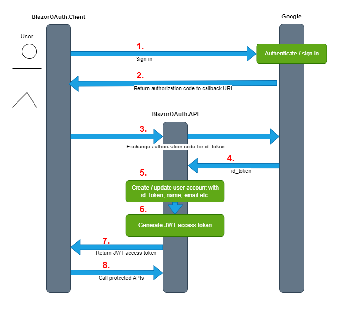

# Blazor WebAssembly with Google Login and Individual User Accounts

This project showcases how to implement external identity provider OAuth authentication and integrate it with application-specific individual user accounts in a Blazor WebAssembly application. The project is designed to serve as a practical reference, a starting point and a playground for developers looking to implement authentication to their client-side apps. The solution presented here frees you from managing the sensitive information, like users passwords, in your systems but still maintaining application-specific user accounts on your server, so that users can customize their own experience in your app. 

Try the live demo at [blazoroauth.azurewebsites.net](https://blazoroauth.azurewebsites.net/)

### Developing locally

In order to develop locally and integrate with Google's authentication, you'll need to create your Credentials in the [Google Cloud Console](https://console.cloud.google.com/)'s APIs & Services. [See here](https://developers.google.com/identity/protocols/oauth2/web-server#creatingcred)

Be sure to specify the Blazor WebAssembly app's authentication callback URI in the ```Authorized Redirect URIs``` section:
> https://localhost:5001/google-login-callback 

Then put the ```clientId``` and ```clientSecret``` you get from Google into the user secrets inside the ```BlazorOAuth.API ``` project.

>"Authentication:GoogleOptions:ClientId": "client-id-here"

>"Authentication:GoogleOptions:ClientSecret": "client-secret-here"

**Note:** Included in the project is a powershell script ```Init.ps1``` that will setup a local Docker container SQL Server database for you, all ready to go (you need to have Docker desktop installed).  

Then start both ```BlazorOAuth.API``` and ```BlazorOAuth.Client ``` projects in their respective folders. The API will run EF Core migrations against the local database at startup.
> dotnet run

### Architectural overview

-   **Frontend Authentication**: The Blazor WebAssembly frontend application initiates the authentication process by taking the user to Google’s authentication page. After the user authenticates with Google, Google returns an authorization code to the frontend application.
-   **Backend Token Exchange**: The frontend then sends this authorization code to the backend API. The backend exchanges the code with Google to retrieve an access token, which includes user information and a unique Google ID which we will use as the unique identifier to be associated with your user account.
-   **User Management**: The backend stores your unique Google ID in the application database and associates it with the user account created during the first sign-in. At the end of successful sign-in, the backend generates a JWT access token (and a refresh token) and returns them to the frontend. The access token is used for communication between the ```BlazorOAuth.Client ``` and ```BlazorOAuth.API``` to ensure that only authorized requests can access protected endpoints. **Note:** We do not store the Google access token, we only need to identify the user in order to create our own JWT.


